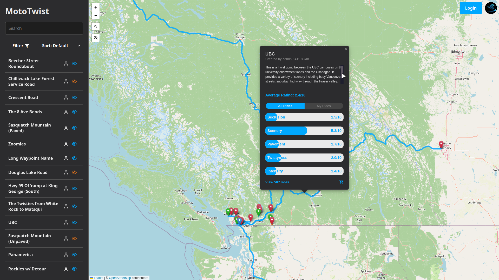

> [!NOTE]
> MotoTwist is a personal hobby project. I am open-sourcing it because others might find it useful, but I make no guarantees about bug fixes, feature requests, or support timelines. I work on this when it's fun for me!


# MotoTwist

_Track the Thrill. Rate the Road._

**[📑 Documentation](https://docs.mototwist.app)** | **[🏍 Web App (Coming Maybe)](https://docs.mototwist.app/coming-maybe)**

MotoTwist is the ultimate companion for every motorcycle enthusiast. Discover, track, and save your most epic journeys. MotoTwist allows you to define and rate motorcycle roads, both paved and unpaved, on various criteria. Weather conditions at the time of ride are also recorded: maybe a rainy day ruined a certain ride, but it's amazing in the sun! MotoTwist has support for multiple users, advanced filters help anyone find the exact road for them and the current conditions, and an ability to export it all to GPX and take it with you.

Share your favorite roads with a community of fellow riders and find your next great adventure, recommended by those who've ridden it before.




## Developing

Follow these steps to set up and run the application in development mode.

1.  **Clone the repository:**
    ```bash
    git clone git@github.com:amot-dev/MotoTwist.git
    cd MotoTwist
    ```

2.  **Configure environment variables:**
    Find `.env.example` in the project's root directory. Copy this into your own `.env` file. Uncomment the developer options.

3.  **Build and run the containers:**
    Use Docker Compose to build the image and start the services. A handy `build.sh` script exists that does just this, as well as a few other things.

4.  **Access the application:**
    Open your web browser and navigate to `http://localhost:8000`.

5.  **Load mock data:**
    With debug mode enabled, admin users will have access to the debug page, which allows saving and loading the current database state, as well as seeding random rides.

> [!TIP]
> Saving rides is mostly useless unless you're using debug mode to migrate your data. Prefer saving Twists and seeding ride data after loading.

6.  **Set up a `venv`:**
    This is recommended for static analysis.
    ```bash
    python -m venv .venv
    source .venv/bin/activate
    python -m pip install pip -U # optional
    python -m pip install requirements.txt # for exact pinned versions
    python -m pip install requirements.in # for latest versions (untested)
    ```

8.  **Start Developing:**
    More thorough documentation for this is coming (maybe), but I'm sure you can figure it out.

9.  **Updating packages:**
    High-level dependencies are stored in `requirements.in` and versions are pinned in `requirements.txt`. Pending a more robust package management system than pip (too busy to switch over at the moment), the process is as follows:
    ```bash
    python -m pip install --upgrade pip pip-audit pip-tools   # Install dev dependencies
    python -m pip install -r requirements.in                  # Install dependencies
    python -m pip piptools compile --upgrade requirements.in  # Update requirements.txt
    python -m pip_audit -r requirements.txt                   # Check for vulnerabilities
    ```
    Ensure the new versions are well-tested. If the Python version goes up, ensure the image is updated in the `Dockerfile` too.

> [!TIP]
> You may run mototwist in an interactive terminal with:
> ```bash
> docker compose run --service-ports mototwist
> ```

> [!TIP]
> Email functionality can be tested with MailHog (included by `docker-compose.override.yml`):
> ```bash
> # Email Options
> EMAIL_ENABLED=True
> SMTP_HOST="mailhog"
> SMTP_PORT=1025
> SMTP_USERNAME="anything"
> SMTP_PASSWORD="anything"
> SMTP_FROM_EMAIL="anything@anything.com"
> SMTP_USE_TLS=False
> ```
> Navigate to `http://localhost:8025` to view the fake inbox.

7.  **Migrate the database if needed:**
    If you make any model changes, you'll need to make a migration from them. All migrations are applied to the database on container restart.
    ```bash
    docker compose run --rm mototwist create-migration "Your very descriptive message"
    ```

> [!TIP]
> If you want to modify criteria, make changes to `initialize_criteria` in `app/services/rides.py` and restart with a fresh database.
